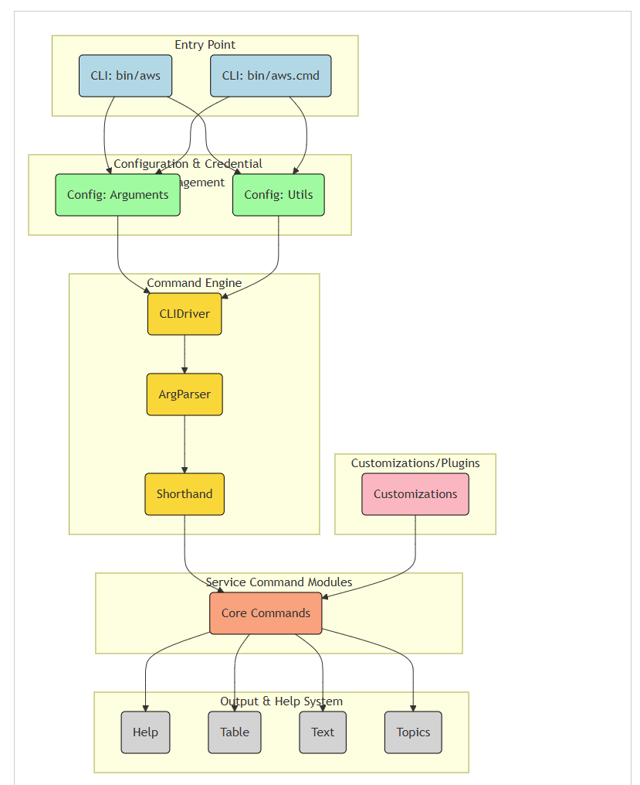

# GitDiagram セットアップと利用手順書

この手順書では、GitDiagramをセットアップして利用するまでの全手順を、devコンテナ環境とローカルPCでの作業を明確に区別して説明します。また、発生する可能性のあるエラーとその対処法も含めています。

## 1. 前提条件

* ローカルPC: Docker、Docker Composeがインストール済み
* devコンテナ環境: `/docker_work/cline`ディレクトリにアクセス可能

## 2. GitDiagramのセットアップ

### 2.1. リポジトリのクローン（devコンテナ内）

```bash
# devコンテナ内で実行
cd /docker_work/cline
git clone https://github.com/ahmedkhaleel2004/gitdiagram.git
cd gitdiagram
```

### 2.2. シェルスクリプトの改行コード修正（devコンテナ内）

Windowsで作成されたシェルスクリプトの改行コードを修正します。

```bash
# devコンテナ内で実行
cd /docker_work/cline/gitdiagram
sed -i 's/\r$//' backend/entrypoint.sh
sed -i 's/\r$//' start-database.sh
```

改行コードが正しく修正されたか確認：

```bash
# devコンテナ内で実行
file backend/entrypoint.sh start-database.sh
```

期待される出力：

```javascript
backend/entrypoint.sh: Bourne-Again shell script ASCII text executable
start-database.sh:     Bourne-Again shell script ASCII text executable
```

### 2.3. バックエンドのCORS設定修正（devコンテナ内）

ローカルHTMLファイルからのアクセスを許可するため、CORSの設定を修正します。

```bash
# devコンテナ内で実行
cd /docker_work/cline/gitdiagram
```

`backend/app/main.py`ファイルを編集し、以下のように変更：

```python
# 変更前
origins = ["http://localhost:3000", "https://gitdiagram.com"]

# 変更後
origins = ["http://localhost:3000", "https://gitdiagram.com", "null"]
```

### 2.4. APIテストツールの作成（devコンテナ内）

ブラウザからAPIを簡単に使用するためのHTMLファイルを作成します。

```bash
# devコンテナ内で実行
cd /docker_work/cline/gitdiagram
```

`api_test.html`ファイルを作成し、必要な機能を実装：

* GitHubリポジトリのURL入力と解析
* OpenAI APIキー管理（大きなリポジトリ用）
* ダイアグラム生成と表示
* エラー処理とデータ復元機能

## 3. コンテナの起動（ローカルPC）

### 3.1. ファイルのコピー

devコンテナからローカルPCに必要なファイルをコピーします。

```bash
# ローカルPCで実行
# 適切なパスに置き換えてください
mkdir -p /path/to/local/gitdiagram
cp -r /path/to/devcontainer/docker_work/cline/gitdiagram/* /path/to/local/gitdiagram/
```

### 3.2. バックエンドAPIサーバーの起動

```bash
# ローカルPCで実行
cd /path/to/local/gitdiagram
docker-compose up -d
```

### 3.3. PostgreSQLデータベースの起動

```bash
# ローカルPCで実行
cd /path/to/local/gitdiagram
chmod +x start-database.sh
./start-database.sh
```

### 3.4. コンテナの確認

```bash
# ローカルPCで実行
docker ps
```

期待される出力：

```javascript
CONTAINER ID   IMAGE                    COMMAND                   STATUS          PORTS                    NAMES
475d82c22bbb   gitdiagram-api           "/bin/bash /app/entr…"   Up 11 minutes   0.0.0.0:8000->8000/tcp   gitdiagram-api-1
c7cf50e2942b   postgres                 "docker-entrypoint.s…"   Up 3 hours      0.0.0.0:5432->5432/tcp   gitdiagram-postgres
```

### 3.5. CORS設定変更後のコンテナ再起動

```bash
# ローカルPCで実行
docker restart gitdiagram-api-1
```

## 4. GitDiagramの使用方法（ローカルPC）

### 4.1. APIテストツールの使用

1. ローカルPCで `api_test.html`ファイルをブラウザで開く
2. GitHubリポジトリを指定する方法：
   * **方法1** : GitHubのURLを「ユーザー名」欄に入力（例: `https://github.com/fastapi/fastapi`）
   * **方法2** : ユーザー名とリポジトリ名を個別に入力
3. 「ダイアグラム生成」ボタンをクリック
4. 生成状況が表示され、完了するとダイアグラムが表示されます

### 4.2. 大きなリポジトリの分析（OpenAI APIキーの使用）

トークン制限（50,000トークン）を超えるリポジトリを分析する場合：

1. 「▶ OpenAI APIキー設定」をクリックしてセクションを開く
2. OpenAI APIキーを入力して「APIキーを保存」ボタンをクリック
   * APIキーはブラウザのローカルストレージに保存されます
   * 「設定済み」と表示されることを確認
3. GitHubリポジトリを指定して「ダイアグラム生成」ボタンをクリック

### 4.3. おすすめのサンプルリポジトリ

以下のリポジトリで動作確認できます：

* FastAPI: `https://github.com/fastapi/fastapi`
* Flask: `https://github.com/pallets/flask`
* Streamlit: `https://github.com/streamlit/streamlit`
* API Analytics: `https://github.com/tom-draper/api-analytics`
* Monkeytype: `https://github.com/monkeytypegame/monkeytype`

## 5. エラー対応と改良点

### 5.1. JSONパースエラーの対応

ダイアグラム生成中に以下のようなエラーが発生する場合があります：

```javascript
Error parsing SSE message: SyntaxError: Unterminated string in JSON at position XXXX
```

この問題に対応するため、以下の改良を実施しました：

1. **正規表現による完全なJSONの抽出**
   * 完全なJSONデータのみを抽出して処理
2. **部分的なデータからの復元機能**
   * JSONパースに失敗した場合でも、ダイアグラムデータを抽出して表示
   * エスケープシーケンスを適切に処理
3. **デバッグ情報の表示**
   * エラー発生時に詳細情報を表示
   * 抽出されたデータの一部を表示

### 5.2. CORS関連のエラー対応

「Failed to fetch」エラーが発生する場合：

* バックエンドAPIサーバーが起動しているか確認
* コンテナを再起動: `docker restart gitdiagram-api-1`
* ブラウザのコンソールでエラーの詳細を確認（F12キーを押して開く）

### 5.3. トークン制限エラー対応

「File tree and README combined exceeds token limit (50,000)」エラーが発生する場合：

* OpenAI APIキー設定セクションが自動的に表示されます
* APIキーを設定して再試行してください

## 6. 実施した作業のまとめ

### devコンテナ環境での作業

1. GitDiagramリポジトリのクローン
2. シェルスクリプトの改行コード修正（CRLF→LF）
   * `backend/entrypoint.sh`
   * `start-database.sh`
3. バックエンドのCORS設定修正
   * `backend/app/main.py`の `origins`リストに `"null"`を追加
4. APIテストツール（`api_test.html`）の作成と改良
   * GitHubリポジトリのダイアグラム生成機能
   * OpenAI APIキー管理機能
   * エラー処理と復元機能の強化
   * デバッグ情報表示機能

### ローカルPCでの作業

1. バックエンドAPIサーバーとPostgreSQLデータベースのコンテナ起動
   * `docker-compose up -d`
   * `./start-database.sh`
2. コンテナの再起動（CORS設定変更後）
   * `docker restart gitdiagram-api-1`
3. APIテストツールの使用
   * ブラウザで `api_test.html`を開く
   * GitHubリポジトリを指定してダイアグラム生成

## 7. ファイル構成

```javascript
/docker_work/cline/gitdiagram/
├── backend/
│   ├── app/
│   │   ├── main.py (CORS設定を修正)
│   │   └── ...
│   ├── entrypoint.sh (改行コード修正済み)
│   └── ...
├── start-database.sh (改行コード修正済み)
├── docker-compose.yml
├── api_test.html (作成したAPIテストツール)
└── ...
```

以上の手順に従うことで、GitDiagramを正常に動作させることができます。エラーが発生した場合も、改良されたAPIテストツールによって可能な限りダイアグラムを表示できるようになっています。


---


https://github.com/aws/aws-cli


